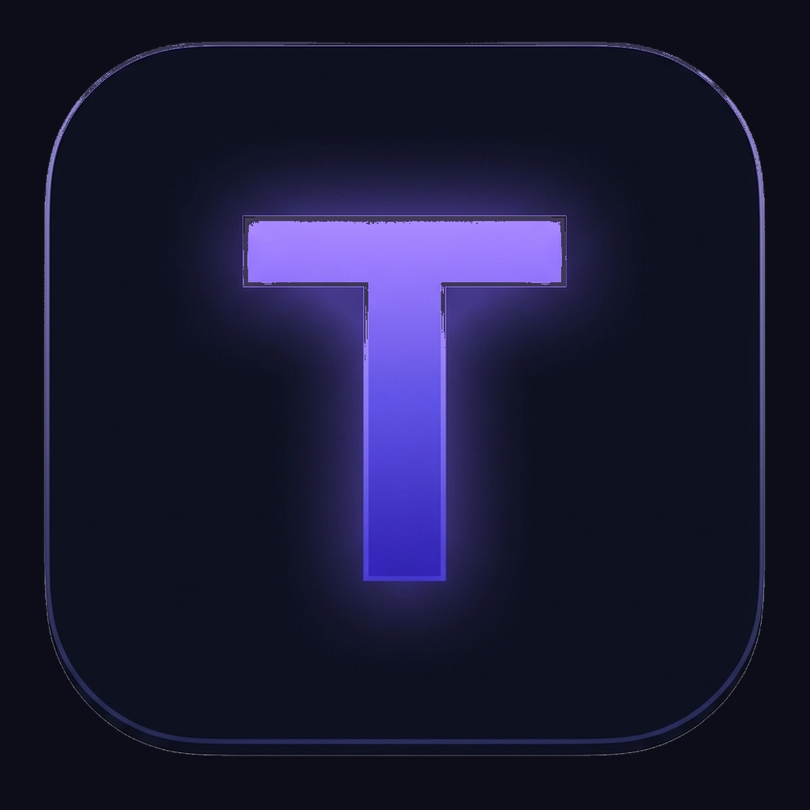

<p align="center">
  
</p>

<h1 align="center">Trakko</h1>

<p align="center">
  A beautiful, fast desktop app for personal project and task management.
  <br />
  Kanban board &bull; Markdown descriptions &bull; Due dates &bull; Claude Code integration
</p>

<p align="center">
  <a href="https://github.com/victortrinh/trakko/releases/latest">
    
  </a>
  <a href="https://github.com/victortrinh/trakko/releases/latest">
    
  </a>
  
</p>

---

## Features

- **Kanban board** — Drag-and-drop tasks across Todo, In Progress, and Done columns
- **Rich task creation** — Title, Markdown description, priority, labels, and due dates
- **Due date notifications** — Native OS alerts when tasks are due or overdue
- **Labels & priority** — Color-coded labels and priority levels (Low, Medium, High, Urgent)
- **Markdown support** — Write and preview task descriptions with full Markdown
- **Full-text search** — Instantly find tasks across all projects
- **Archive** — Bulk archive completed tasks to keep your board clean
- **Claude Code integration** — Embedded AI terminal sessions scoped to your task and project
- **Dark mode** — A clean, Linear-inspired interface
- **Offline-first** — All data stored locally in SQLite, no account needed

## Download

Go to the [latest release](https://github.com/victortrinh/trakko/releases/latest) and download the file for your platform:

| Platform | File | Architecture |
|----------|------|-------------|
| macOS (Apple Silicon) | `Trakko-darwin-arm64-*.zip` | M1, M2, M3, M4 |
| macOS (Intel) | `Trakko-darwin-x64-*.zip` | Pre-2020 Macs |
| Windows | `Trakko-*-Setup.exe` | 64-bit |

> **Not sure which macOS version?** Click Apple menu () > About This Mac. If you see "Apple M1/M2/M3/M4", download **arm64**. Otherwise, download **x64**.

## Installation

### macOS

1. Download and unzip the `.zip` file
2. Drag **Trakko.app** to your Applications folder
3. **Important:** Since the app is not yet code-signed, macOS will block it on first launch. To open it:

   **Option A** — Right-click to open (easiest):
   - Right-click (or Control-click) on **Trakko.app**
   - Select **Open** from the menu
   - Click **Open** in the dialog that appears
   - You only need to do this once

   **Option B** — Remove the quarantine flag:
   ```sh
   xattr -cr /Applications/Trakko.app
   ```

   **Option C** — Allow in System Settings:
   - Open **System Settings > Privacy & Security**
   - Scroll down to find the message about Trakko being blocked
   - Click **Open Anyway**

### Windows

1. Download and run the `Trakko-*-Setup.exe` installer
2. If you see a **Windows SmartScreen** warning (since the app is not yet code-signed):
   - Click **More info**
   - Click **Run anyway**
3. Trakko will install and launch automatically

## Building from source

```sh
git clone https://github.com/victortrinh/trakko.git
cd trakko
npm install
npm run rebuild
npm start
```

To create a distributable:

```sh
npm run make
```

Artifacts will be in `out/make/`.

## Tech stack

- **Electron** + electron-forge
- **React 19** + TypeScript
- **TailwindCSS v4**
- **Zustand** for state management
- **SQLite** via better-sqlite3
- **@dnd-kit** for drag-and-drop

## License

MIT
